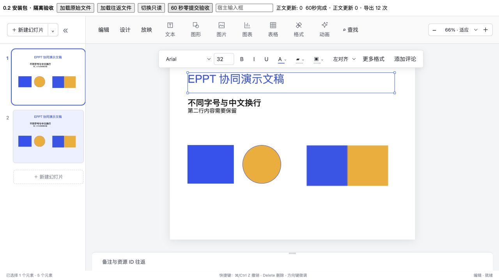
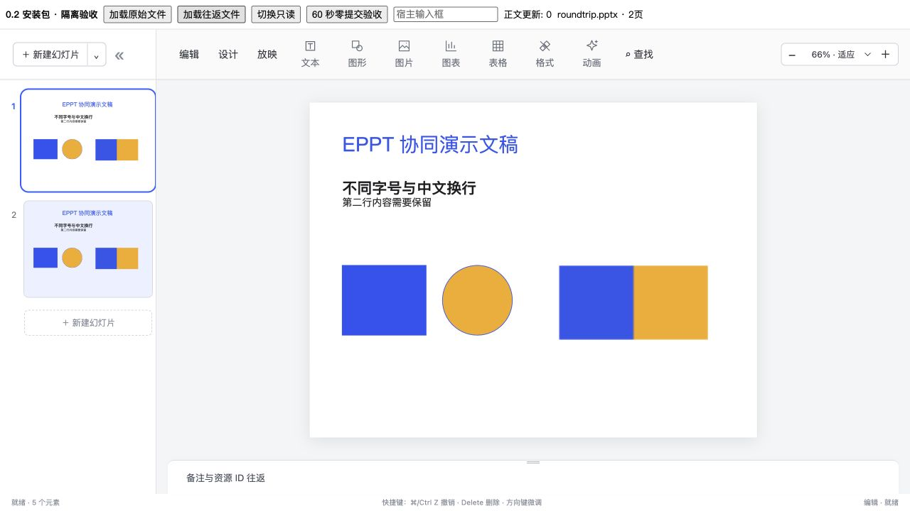

# 在线 PPT 补充交付审计 · 0.2.1

0.3.0-alpha.1 增量以 [在线编辑清单](ONLINE-EDITING-PLAN.md) 为准：新增页面批量管理/隐藏/分节/大纲与高级文字子集，codecRevision 已升级为 5。以下 0.2.x 的旧 codec、未实现条目和验收数字保留为历史，不能当作当前版本的完整状态。

0.2.1 追加大文稿性能优化与隔离压测，见 [性能记录](COLLABORATION-PERFORMANCE.md)。下文原 0.2.0 能力验收边界不变；性能优化不代表新增功能或生产多用户验收。

日期：2026-09-13。本文逐项对应用户补充要求，而非 PowerPoint 全量对齐承诺。**此版本为接入预览，尚不能签署整份首版验收通过。**

状态只使用「已实现」「待实现」「明确不支持」。已实现描述的是限定行为；验收证据单独列明，单元测试、源码联调不冒充实际安装包双会话浏览器测试。

## 一、职责与安全

| 要求 | 状态与实际边界 | 证据 / 剩余工作 |
| --- | --- | --- |
| 原生模型、命令、撤销、协同投影 | 已实现：独立 EMU 幻灯片/元素模型、Y.Map/Y.Array、Slate Y.XmlText | core、controller、session；不是富文本模拟整份 PPT |
| 平台用户查询/卡片、身份/权限、评论通知、站内查询 | 明确不支持：包不提供这些平台业务 | Doca 宿主尚待实际接入；demo 无生产身份认证/租户 ACL |
| 一条协同连接及保存链路 | 已实现：工作台只接受宿主 Y.Doc；不创建 socket/autosave | Session/transport 可选；宿主可使用自己的统一适配器 |
| 稳定文稿/页/元素/资源/会话 ID | 已实现：模型 id、slide.id、element.id、assetId；presence 为 userId/sessionId | 同文件复制重建页/元素/组 ID；图片引用保留宿主 assetId |
| 用户引用、站内文档引用、外链安全协议 | 明确不支持：当前文本没有这些业务对象/链接插入入口 | 不以普通可编辑文字冒充原子用户卡片；未来需 codec/校验/复制/恢复契约 |
| 选区、浮层、面板、评论标记、presence 不提交 | 已实现：本地 React 状态、宿主回调 | WorkspaceContract；完整浏览器 60 秒操作组合仍待验收 |
| 所有命令统一模型校验 | 待实现：已有类型/命令校验及服务端提交校验，但低层 patch 等尚非完整原子校验边界 | 不建议宿主任意调用低层 patch；需进一步限制字段、资源标识及隐藏数据输入 |
| 图片失败局部恢复 | 已实现：解析器异常/图片加载失败显示局部占位，可重试；assetId 保留 | ResourceImage 测试；画布普通删除仍走命令。原地替换、上传占位队列/可恢复上传草稿待实现 |
| 自定义元素异常隔离 | 明确不支持：尚无任意自定义元素扩展 API | 不把 render 回调或临时地址序列化进正文 |
| 文件交换降级警告 / 无 JSON UI | 已实现：issues 与 warnings 为同一结构化数组（slideId/elementId/message） | PPTX 按支持子集转换，host 决定提示；无每条警告确认；无普通 JSON 入口 |
| 不清理文稿/缓存 | 已实现：本轮未清空数据库、浏览器存储或测试文稿 | 只使用新增隔离房间；历史数据保留 |

## 二、首版能力与接口

| 要求 | 状态与实际边界 | 证据 / 剩余工作 |
| --- | --- | --- |
| 铺满宿主子页面、无平台页头 | 已实现：默认 embedded，height:100%，宿主提供有高度容器 | `chrome="demo"` 仅显式演示外壳；包不默认显示标题、在线成员、保存提示或文件菜单 |
| 宿主标题 | 已实现：仅 demo 外壳 `onTitleChange` 回调 | 嵌入模式无标题编辑；历史模型 title 仍用于文件元数据，不强制作为 Doca 业务标题 |
| 面板隐藏不重建编辑器 | 已实现：panels / onPanelsChange、handle.setPanels | slides/properties/notes；受控字段需要宿主响应回调；原 Y.Doc/编辑器保留 |
| 文字/图片/常见形状/线/平面组/层级/对齐/背景 | 已实现：限定基础功能 | 已有模型、渲染、撤销和往返测试；不是完整设计排版系统 |
| 主题/母版/版式继承 | 明确不支持：无主题绑定/母版继承 | 仅内置独立布局预设；导入读取基础调色板，不构成主题继承 |
| 表格/图表/动画 | 已实现：基础表格、有限 AntV 图表、三类入场动画 | 表格同格整段 LWW，图表整块提交；不支持 Office 全部类型/轴/特效/时间线 |
| 音视频、SmartArt、公式、复杂效果 | 明确不支持 | 未展示无动作的插入入口 |
| 新增/删除/复制/排序稳定 ID | 已实现：单项 CRDT 命令，未覆盖整份 slides 数组 | 并发新增保留；同页多次移动保留一个可见 ID，顺序按 Yjs 合并后的首个可见位置确定，不承诺“最后拖动胜出” |
| 删页/删元素与他人编辑、撤销恢复 | 已实现：codec 4 删除标记保留嵌套身份 | delivery-contract 测试：删除隐藏、远端修改保留、撤销后恢复，文本 Y.XmlText 身份不变、checkpoint 一致；网络浏览器组合待验收 |
| 复制相关引用 | 已实现：新页/元素/groupId，表格新元素生成新行列身份 | 同文稿资源引用不复制二进制；跨文稿授权复制/系统富剪贴板待实现 |
| presence 按会话、当前页绘制 | 已实现：slideId + elementIds，排除当前 session，不按 userId 排除 | 同账号双会话协议测试已有；readonly/放映不画编辑光标。完整编辑起止/文字相对选区/缩略图页上提示待实现 |
| 评论集合锚点/失效/定位/点击 | 已实现：CommentAnchor elements；resolveAnchor、commentCandidates、handle.revealAnchor；commentMarkers/onCommentAnchorClick | 部分元素删除返回 partial，全部删除/删页返回 null；候选按共同对象身份，不以序号/像素为锚点。host owns chooser/drawer |
| 浮动评论动作 | 已实现：renderCommentAction(anchor)，只传锚点，不存评论 | host 注入按钮并自行判断评论权限。默认无评论 UI，不改变投影片尺寸 |
| 文字子范围评论 | 待实现：底层 search 使用 Y.RelativePosition，尚无原生选中文字捕获接口 | captureAnchor 对文本选区返回元素锚点；不要宣传字符级内容评论已交付 |
| 资源上传/显示/授权导出 | 已实现：resources.uploadImage/resolveUrl，exportPptx 独立授权 resolver | host owns ACL；导入图片获取新 ID；不得把 demo 路由当正式 Doca 适配 |
| 演示本地视图/按键范围/退出恢复 | 已实现：presentation/onPresentationChange、handle.setPresentation、前后页/Esc/全屏按钮 | 进入清空本会话 presence，翻页不发布；快捷键局限 dialog。全屏真实环境组合仍需补验 |
| 只读查看/选择/搜索/授权导出 | 已实现：无编辑命令、画布对象选择、模型查找及 host export；查找按钮/面板/快捷键统一由 Doca 提供，包内不展示或拦截 | 未实现系统富剪贴板导出；输入框快捷键不被放映窗口全局监听抢占 |

## 三、文件交换

| 要求 | 状态与实际边界 | 证据 / 剩余工作 |
| --- | --- | --- |
| PPTX 导入/导出 | 已实现：纯 `/pptx` 入口，基本原生可编辑对象 | 普通对象/样式可读；缺失关系会给出警告，复杂对象可能未导入 |
| 导出结果 | 已实现：`{blob, filename, mime, warnings, issues}` | 开始即 structuredClone + validate；异步图片读取期间后续修改不混入文件；宿主触发下载 |
| 导入结果 | 已实现：`{document, assets, warnings, issues}` | 默认新业务资源/new epoch；不复用原业务资源/用户/评论身份；不重置 outbox |
| PNG 单页 | 已实现：浏览器裸画布 handle.exportPng / 工作台 exportCurrentPng、onExportPng | 目前为已挂载当前画布导出，**并非固定模型快照的任意页转换器**；该完整验收项待实现，不建议把此入口直接当生产缩略图服务 |
| 缩略图按需/失效 | 已实现：SlidePreviewStore.getSnapshot(slideId)/subscribe(changedIds)/dispose + memo SlidePreview | 是单页模型快照和 React 预览，不是 PNG 服务；正文变化才比较，presence/选区不重新生成全部预览。虚拟化/任意页 PNG/资源变化显式失效待实现 |
| PDF、旧 PPT、PPTM | 明确不支持：PDF 只有宿主浏览器打印演示，不是包正式转换能力；不解析旧 PPT/宏文件 | 没有生产 PDF 完整性承诺 |
| 复杂母版/主题字体/特殊效果/动画/嵌套组 | 明确不支持无损还原 | 原生分组 fixture 是已知降级反例：导入 grpSp 尚未展开；在线平面组并不等于 OOXML 组 |

## 四、版本与数据

`@eppt/editor@0.2.0`，schemaVersion **2** / protocolVersion **1** / codecRevision **4**。4 增加页和元素的内部 deleted 标记。投影隐藏被删对象，完整 checkpoint 仍保留原始嵌套 CRDT。新包读旧版本中仍存在的对象无需重建；已经被旧版物理删除/GC 的并发内容无法凭空恢复。

宿主与所有客户端、校验端需一起升级，缺失/旧/未来未知 codec revision 在握手拒绝；epoch 校验不放宽。**不得将携带 4 标记的房间降级到 3 客户端。** 保留旧包只是回退资源，不表示可直接回退已使用新删除语义的房间。演示宿主未覆盖原房间基线，未清 outbox；未确认数据仅在内存中，持久离线恢复待实现。删除标记增加存储，垃圾回收/长期增长控制待实现；不能 JSON 重建 checkpoint 来“压缩”。

## 五、验收账本

| 场景 | 当前证据 | 验收状态 |
| --- | --- | --- |
| 两副本删页/删元素 vs 编辑、复制、排序、撤销/重载 | delivery-contract + reorder + controller；实际 CRDT 更新交换 | 已实现且模型测试通过；**实际安装包双浏览器同/异页组合待验收** |
| 重连、重复/未知/迟到 ACK、保存状态、旧版本拒绝 | session/outbox、真实服务器隔离房间测试 | 已实现且测试通过；生产 Doca session/ACL 未接入 |
| 全选删除后中文输入 | Slate/Yjs 原生模型测试 | 已实现且模型测试通过；中文 IME 真实键盘组合待验收 |
| readonly、面板/评论/放映不提交 | WorkspaceContract（画布替身）+ ResourceImage + 原有浏览器测试 | 已实现且限定测试通过；不能当安装包所有画布路径已验 |
| 60 秒选区/滚动/导出零提交 | 源码 idle 静置/readonly 60 秒；实际安装包单会话超过 60 秒定位选区、切换面板、12 次 PPTX 导出，Y.Doc update 计数 0 | **部分验收：真实有位移的滚动、双会话与宿主网络提交计数仍待验收**；自动滚动请求在适应窗口下可能被边界限制，不计作真实滚动证明 |
| 真实 PPTX 与往返 | fixtures/basic-4x3.pptx、basic-4x3-roundtrip.pptx；中文/字号/换行/图片/形状/两页/4:3；导出平面组展平警告 | 原生组反例另附，不宣称完整组导入通过；桌面三软件按用户决定暂缓 |
| 安装包、唯一 hash、README/类型/最小宿主示例 | artifacts/RELEASE.md、examples/doca-host.tsx | 按最终包结果更新，不以源码构建代替安装验证 |
| 性能 / 超限 / 安全 | 下节 | 浏览器大文稿载入、缩略图帧率、峰值内存仍待验收 |

## 六、容量与输入限制

- 已有模型硬校验：最多 **500 页，每页 2,000 元素**；每个文本叶子 100,000 UTF-16 单元；表格 100×100。不是顺畅运行承诺，也未承诺最大 100 万元素实际可用；并发操作超限服务端拒绝，不截断保存。
- PPTX 压缩输入最多 **30 MiB**，标准 ZIP 最多 **10,000 条目**，中央目录声明解压总量最多 **60 MiB**，解析中也检查已读取大小。拒绝 ZIP64、分卷及加密文件。
- ZIP 目录配额不是完整恶意 ZIP 防护：伪造的声明大小、极端压缩流/解析器 CPU/实体攻击、worker 隔离/超时仍需加固。
- Demo 图片：仅 PNG/JPEG/GIF、每张 10 MiB，基础签名检查；SVG/其他格式需安全转换。**图像像素尺寸/解码内存上限尚待实现，当前不适合开放任意不可信大图。** Host 应先限制图片尺寸/扫描后接入。
- 本轮性能脚本测量 Node 的模型初始化、缩略图模型缓存和快照；不把这些数值当浏览器绘制/内存证明。见 fixtures/PERFORMANCE.md。最大页数压力、浏览器峰值和长期墓碑增长未验收。

所有未验收项保留为交付缺口。此清单优先于旧记录中笼统的“已验证”“最终包验证”表述。

## 七、本轮具体结果

最终代码回归：31 文件 / 98 测试通过（真实 HTTP/WS 测试和 60 秒静置启用）。新测试包括删除 vs 编辑及撤销身份、并发复制与排序、集合锚点、预览失效、导出异步快照和 ZIP 目录配额。安装包的 core/pptx 子路径、示例 TypeScript、真实下载 PPTX 再次往返通过。

安装包浏览器已检查：默认无平台页头、4:3 原文件/往返文件布局、上述 60 秒单会话操作、宿主评论动作/候选点击、只读放映/下一页/Esc、宿主输入框。**没有据此认定所有安装包双会话场景通过。**

